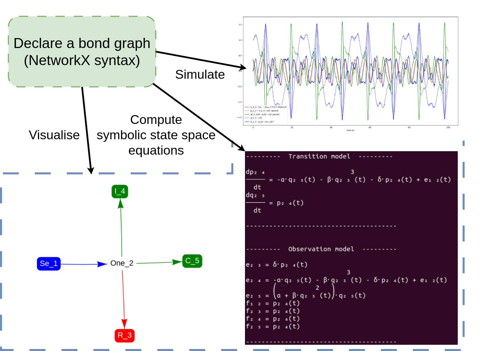

# pybondgraph
A lightweight modelling and simulation library for multi-physics systems, based on bond graph theory. Compatible with nonlinear and symbolic relationships.

This library is based on `NetworkX` for modelling a system as a bond graph, `Sympy` for generating symbolic equations between variables (state-space and more), `Scipy` for simulation purposes and `PyVis` for graph visualisation.



## Installation

```bash
conda env create -f environment.yml
conda activate pybondgraph_env
pip install -e .
```

## Requirements
* networkx
* sympy
* scipy
* pyvis

## Run the demo

```bash
cd scripts
python duffing.py
```
